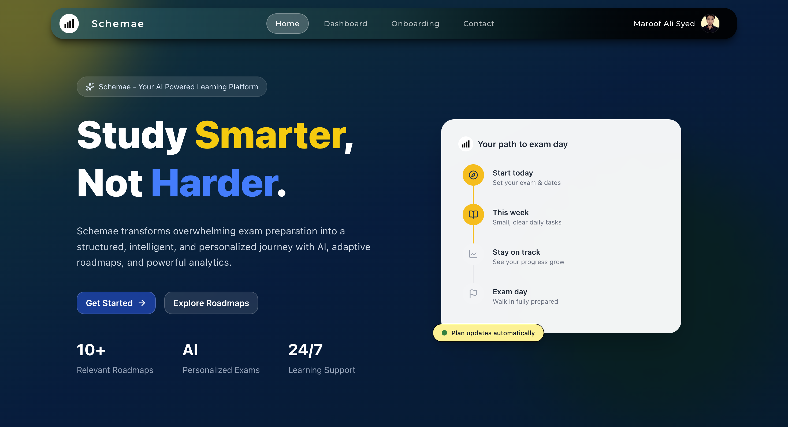
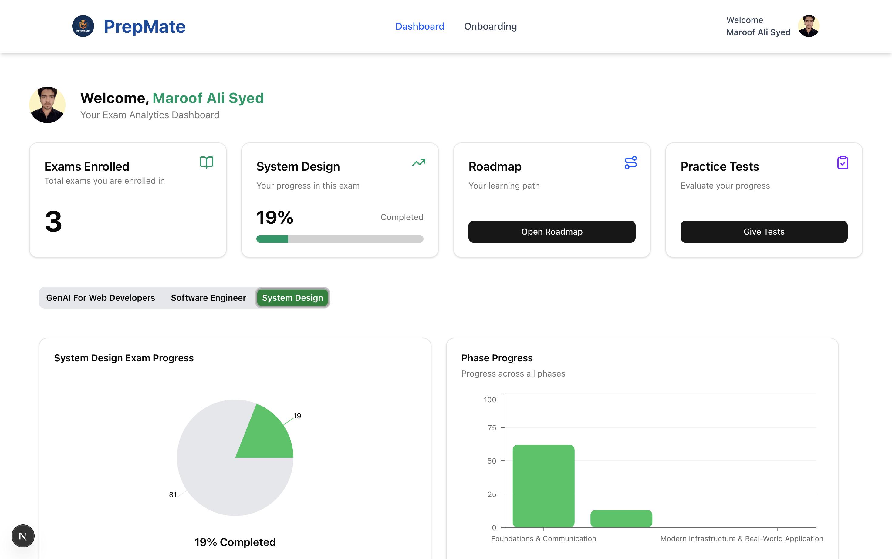
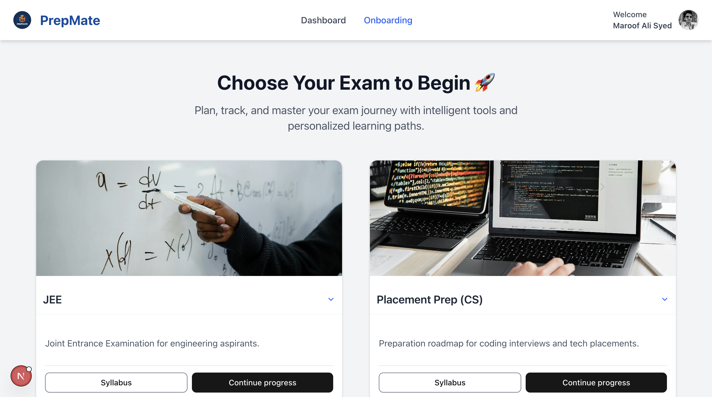
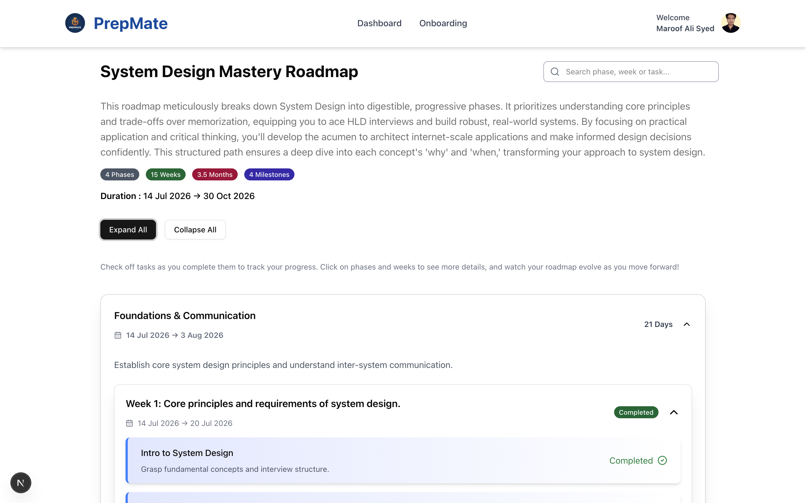

# Schemae - An AI-Powered Study Companion

A modern, interactive full-stack web application that serves as an AI-powered study companion for students. Built with Next.js, Tailwind CSS, and modern web technologies, **Schemae** offers dynamic content, personalized study roadmaps, progress tracking, and AI-driven recommendations to enhance the learning experience.

<p align="center">
  
</p>

---

## Usage

- Generate personalized study roadmaps
- Access curated learning resources and materials
- Track preparation progress through interactive dashboards
- Get AI-driven study recommendations
- Organize and manage exam preparation
- Engage with a clean, modern, and user-friendly interface

---

## 🚀 Features

- AI-powered personalized study roadmaps
- Dynamic exam and learning content
- Progress tracking and interactive dashboards
- CMS-driven content rendering
- Smooth animations and micro-interactions
- SEO-optimized pages using SSR and SSG
- Fully responsive, mobile-first layout
- Reusable and scalable component architecture
- Clean, accessible, and modern UI design
- Optimized performance and fast load times

### 🏠 Homepage

<p align="center">
  
</p>

### 📊 Dashboard

<p align="center">
  
</p>

### 📄 Onboarding Page

<p align="center">
  
</p>

### 🛣️ Roadmap

<p align="center">
  
</p>

---

## 🛠 Tech Stack

### Frontend

- **Next.js** – React framework with server-side rendering and modern routing
- **React.js** – Component-based UI development
- **Tailwind CSS** – Utility-first CSS framework
- **Shadcn/UI** – Accessible and composable UI components
- **Gemini AI API** – AI-powered content and study plan generation

### Backend

- **Prisma** – Type-safe database ORM
- **PostgreSQL** – Relational database
- **Better Auth** – Authentication and session management
- **Next.js API Routes** – Backend API and server-side logic

---

## 📂 Project Structure

```text
├── app/                # Next.js App Router
├── components/         # Reusable UI components
├── lib/                # Utilities, server functions, and helpers
├── styles/             # Global styles
├── public/             # Static assets
└── README.md           # Project documentation
```

---

## 🔧 Getting Started

### 1. Clone the repository

```bash
git clone https://github.com/maroofinagit/schemae.git
```

### 2. Navigate to the project

```bash
cd schemae
```

### 3. Install dependencies

```bash
npm install
```

### 4. Configure environment variables

Create a `.env` file in the root directory and add the required environment variables.

### 5. Start the development server

```bash
npm run dev
```

Open http://localhost:3000 in your browser to view Schemae.

---

## 📈 Performance & Best Practices

- Server-side rendering and static generation where appropriate
- Optimized images and static assets
- Efficient server-side data fetching
- Clean separation between server and client components
- Minimal unnecessary client-side JavaScript
- SEO-friendly routing and metadata
- Type-safe database operations with Prisma
- Scalable and maintainable project architecture

---

## 🧠 What This Project Demonstrates

- Strong command of modern full-stack web development
- Practical use of Next.js and the App Router
- AI integration for personalized learning experiences
- Database design and type-safe data access with Prisma
- Authentication and protected application routes
- UI/UX attention to detail
- Responsive and accessible interface development
- Production-oriented code organization and architecture

---

## 📌 Possible Enhancements

- Mobile application
- Real-time collaboration features
- Advanced analytics and performance insights
- More AI-powered study assistance
- AI-powered conversational study support
- Expanded exam and assessment systems
- Integration with third-party educational platforms
- Social and community-based learning features

---

## 📄 License

This project is licensed under the **MIT License**.
